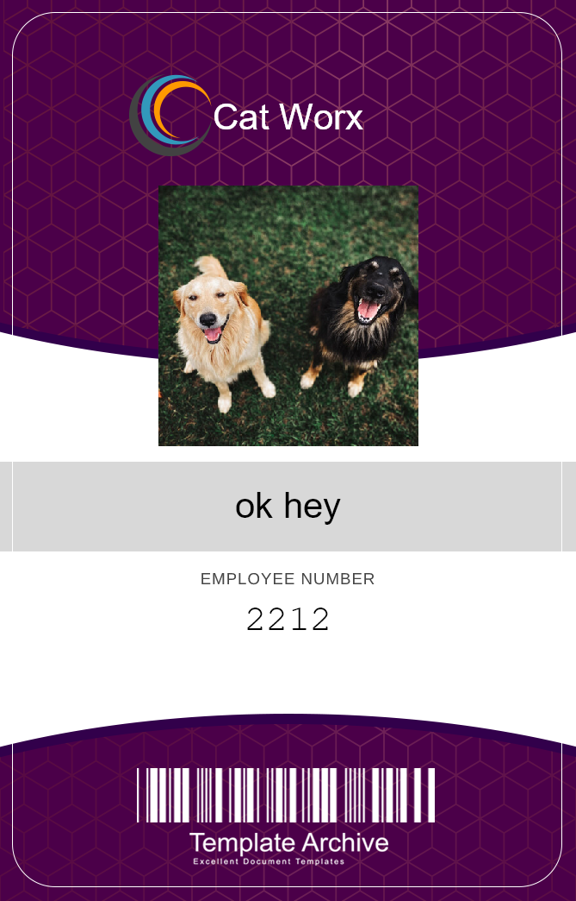

# CatWorx-Security

  ## Table of Contents

  * [Screenshots](#screenshots)  
  * [User-Story](#user-story)
  * [Description](#description)
  * [Installation](#installation)
  * [Usage](#usage)
  * [Contributions](#contributions)
  * [Tests](#tests)
  * [License](#license)
  * [Questions](#questions)

 
  

  ---

  ## Screenshots
  
  

  ## User-Story
  * AS A USER I WANT to create empoyee badges 
  * THEN save the data to a file 
  * SO THAT Employees can be identified

  ## Description
  #### This application creates employee badges for a mock-up company CatWorx
  ##### The Badgemaker is a command line interface application built using C# to demonstrate the ability to create badges using recieved data either from the user or the Random User Generator API

  ## Installation
  Download or clone this repository from your code editor. Open up Microsoft Powershell and type the command "dotnet run" and hit enter to launch.

  ## Usage
  All data saved as .PNG files in "data" folder of appication.

  ## License 
  MIT
  

  ## Questions

  If any questions arise..

  Visit my Github at: [https://github.com/austinslatey](https://github.com/austinslatey)
  
